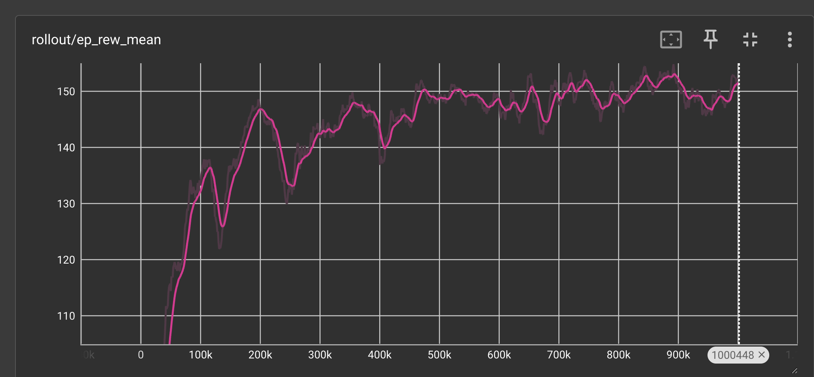
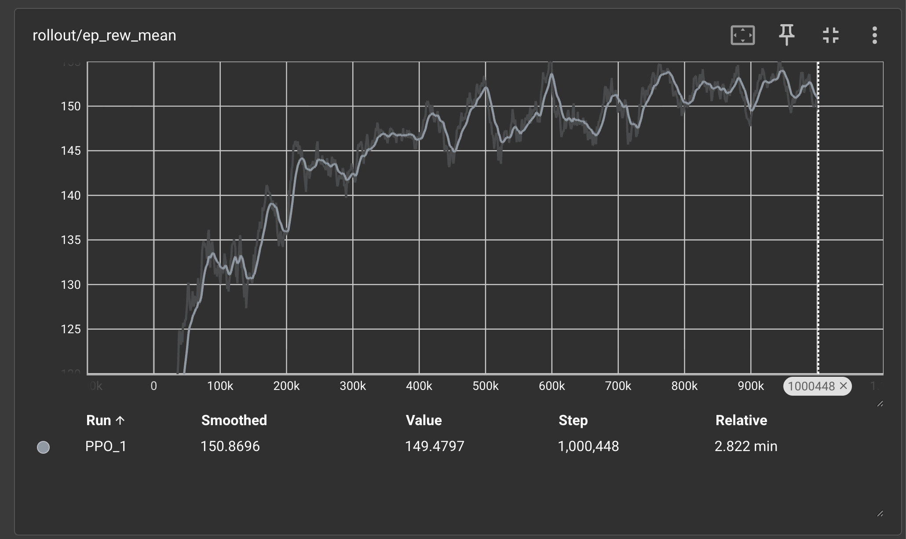
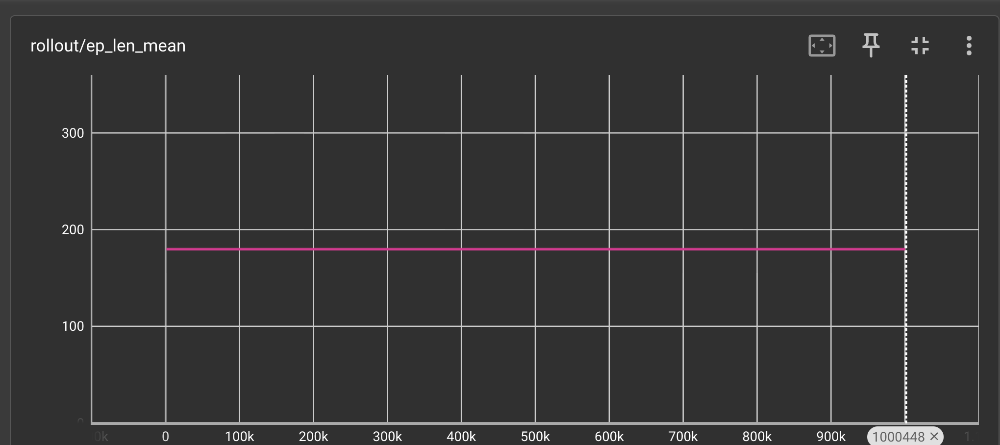
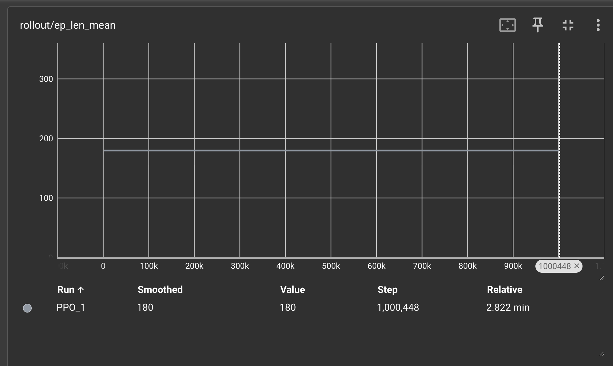
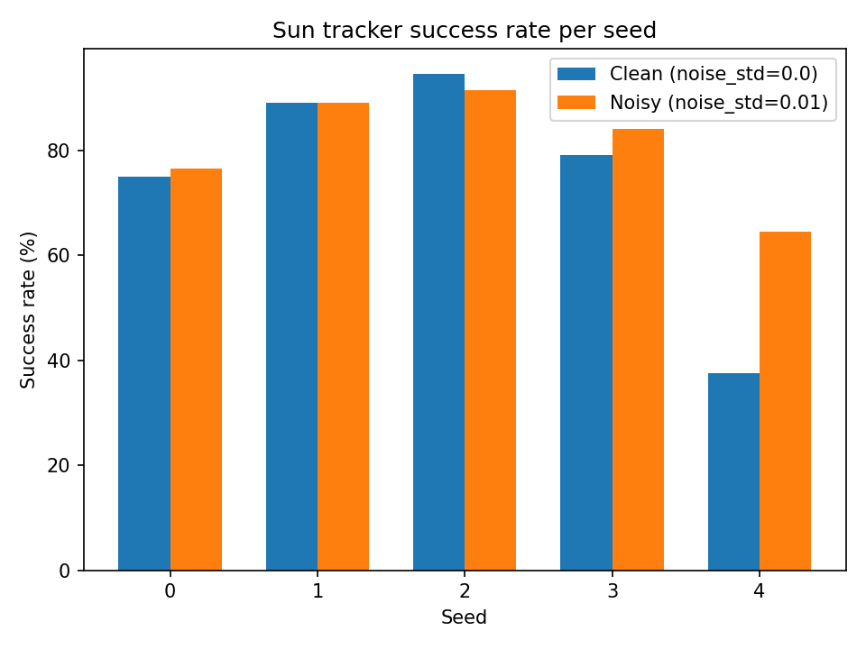

# 🌞 Reinforcement Learning for Sun Tracking

A complete simulation environment and PPO controller for autonomous solar dish alignment.  
This README contains the full technical description, all equations (in code blocks for GitHub compatibility), and the full methodology.

---

# 1. Introduction

This project trains a reinforcement learning (RL) agent to control a dual-axis solar dish.  
The agent observes:

- azimuth angle `az`
- elevation angle `el`
- angular velocities `az_dot`, `el_dot`
- measured power `P`
- change in power `ΔP`

The agent outputs:

- commanded azimuth angular velocity
- commanded elevation angular velocity

Reward = the measured solar power.

---

# 2. Sun Model

The Sun is modeled using the Astral library.  
Astral provides azimuth and elevation angles at each simulation timestamp.

## 2.1 Conversion to ENU vector

Given:
- `az` (sun azimuth, radians)
- `el` (sun elevation, radians)

The Sun direction vector **s** is computed as:

sx = cos(el) * cos(az)
sy = cos(el) * sin(az)
sz = sin(el)

## 2.2 Time progression

Simulation time evolves as:

## Time Update Step

At each simulation step, time advances by a fixed interval Δt:

t_new = t_old + Δt

At every step, the Sun vector is recomputed.

---

# 3. Dish Dynamics Model

The dish has:

- angles: `az`, `el`
- angular velocities: `az_dot`, `el_dot`

The RL agent does **not** set angles directly — it commands **angular velocities**.

## 3.1 Motor lag model (first-order system)

Real motors cannot instantly change velocity.  
We use a first-order lag:

x = x + (v_cmd - x) * (Δt / τ)

Where:
- `x` = actual velocity (`az_dot` or `el_dot`)
- `v_cmd` = commanded velocity from the agent
- `τ` = time constant

## 3.2 Angle integration

Angles update according to:

az = wrap( az + az_dot * Δt )
el = clip( el + el_dot * Δt )

- `wrap` keeps azimuth in `[-π, π]`
- `clip` keeps elevation between `[0, π/2]` (never below horizon)

## 3.3 Dish direction vector

Given current angles:

nx = cos(el) * cos(az)
ny = cos(el) * sin(az)
nz = sin(el)

This defines the dish’s unit pointing vector **n**.

---

# 4. Power Measurement Model

Power measures alignment between dish vector **n** and Sun vector **s**.

## 4.1 Ideal power

P = max(0, dot(n, s))

## 4.2 Sensor noise

P_measured = clip( P + ε )
ε ~ Normal(0, σ²)

Noise forces the agent to learn a robust policy.

---

# 5. Reinforcement Learning Environment (Gymnasium)

## 5.1 Observation vector (6D)

[ az, el, az_dot, el_dot, P, ΔP ]

Where:

ΔP = P - P_prev

## 5.2 Action space (2D)

Agent outputs normalized values:

[a_az, a_el] ∈ [-1, 1]

Converted to real angular velocities:

v_cmd = action * v_max

## 5.3 Reward

reward = P

## 5.4 Episode termination

Fixed horizon:

T_max = 90 seconds
Δt = 0.5 seconds
steps_per_episode = 180

---

# 6. PPO Training Pipeline

## 6.1 Neural policy

A simple 2-layer MLP:

128 → 128 → outputs

## 6.2 Hyperparameters

| Parameter | Value |
|----------|--------|
| Learning rate | 3e-4 |
| Rollout length | 1024 |
| Batch size | 256 |
| γ | 0.99 |
| λ | 0.95 |
| Total steps | 1,000,000 |

### Rollout meaning
Collect **1024 environment steps** before PPO updates.

### Batch meaning
Use **256 samples** to compute each gradient update.

Noise (σ = 0.01) is applied during training only.

---

# 7. Evaluation

We evaluate over many episodes, measuring:

- total reward
- last power
- tail average power (mean of last k steps)

Success:

tail_power > 0.95

---

# 8. Multi-Seed Experiments

We train on seeds:

[0, 1, 2, 3, 4]

For each:

- train PPO for 1M steps
- evaluate clean (noise=0)
- evaluate noisy (noise=0.01)

Results are plotted and saved to `results/`.

---

# 9. Results

### Episode Reward (clean)

### Episode Reward (noisy)

### Episode Length

### Multi-seed Success Rates

---

